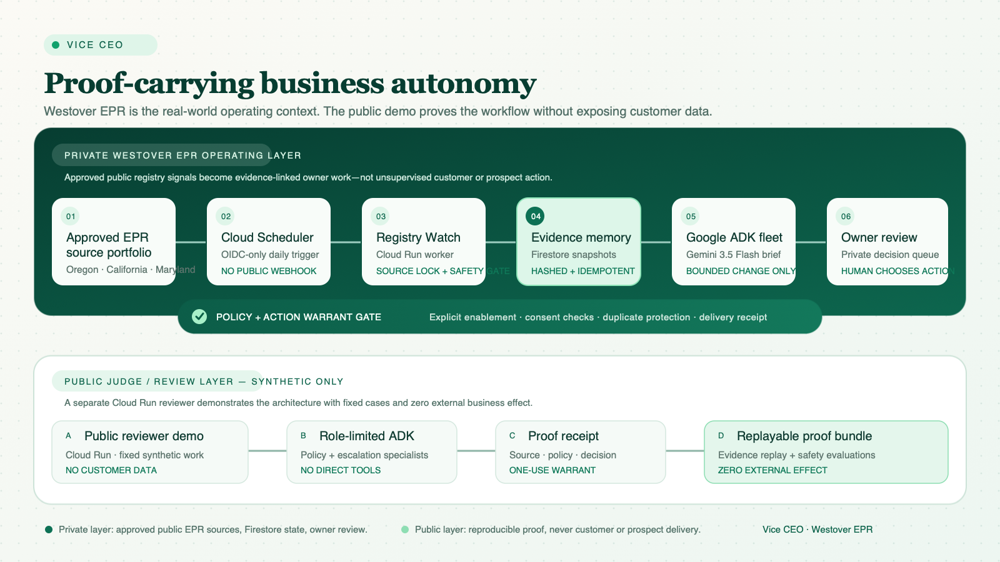

# Vice CEO — Judge Packet (Working Draft)

**Status:** Working draft; nothing has been sent to Devpost. The public
reviewer demo is fixture-only, while a separately verified private Registry
Change Watch runs on Cloud Run with Cloud Scheduler OIDC, Firestore evidence
state, a curated official EPR portfolio (Oregon, California, and Maryland),
and a hash-only Gemini canary.
It has no customer-data connector or prospect messaging authority. Its
owner-only briefing channel has one controlled Resend delivery receipt and
remains unavailable for customer, prospect, or commercial messaging.

## Submission positioning

**Title**
Vice CEO: Proof-Carrying Business Autonomy

**One-line summary**
A reusable business-autonomy operating system where every decision is bound to
inspectable evidence, a narrow one-use warrant, and a replayable decision
trail; Westover EPR is its first live registry-monitoring deployment.

**Recommended category**
Fortified Enterprise Fleet — the code is structured as a four-role Google ADK
specialist fleet with a separate policy/warrant gateway, scoped knowledge
access, audit surfaces, and zero direct business-tool authority.

**Important fit caveat**
This is the strongest architectural match. The private EPR watcher is deployed
and independently evidenced, while the public demo stays synthetic and
reproducible. The final recording must show both layers and keep their distinct
authority boundaries plainly visible.

## Judge-facing description

Most business agents make a recommendation and leave people to trust a black
box. Vice CEO treats the proof of a decision as part of the decision itself.
It is a reusable operating pattern for high-stakes workflows: a bounded signal
becomes evidence, specialists advise without broad tool authority, a scoped
warrant gates the next step, and the result remains replayable. Westover EPR is
the first real background deployment: it watches an approved official EPR
source, preserves a normalized evidence hash, and creates an internal
operational brief only when the source materially changes.

The project routes a named synthetic support case through a small Google ADK
specialist fleet. Support Intake can read the bounded fixture; Policy Guard,
Owner Escalation, and the router have no direct business tools. A separate,
server-owned Action Warrant gateway is the only route to the demo transition.
It accepts a signed, short-lived, role-scoped warrant once, then refuses a
replay, a tampered warrant, changed control state, or an unknown input.

The result is not just a generated answer. A reviewer can inspect the evidence
chain, see the rejected alternative, replay the supplied decision record
without rerunning the workflow, verify a closed source-artifact manifest, and
run the adversarial/evaluation suites. The Trust Engine never rises above
`simulation_only`; external effects, customer data, persistent writes, and
production authority remain disabled.

Vice CEO has two deliberately separated layers: a public, synthetic,
zero-effect reviewer experience and a private Registry Change Watch. The
private worker uses Cloud Scheduler OIDC, a locked public-source allowlist,
Firestore idempotency/snapshots, and visible-content fingerprinting that avoids
volatile page scaffolding. A dedicated untrusted-source safety gate keeps
instruction-like public text out of the Gemini briefing path and falls back to
a deterministic, evidence-linked owner review. The worker currently makes no
customer, billing, prospect, or administrative action. A dedicated credential,
verified sender, and allowlisted owner mailbox produced one controlled
non-production delivery receipt; no customer or prospect delivery is enabled.

## Why it matters

High-value business work demands more than a fluent model response. Operators
need to know which evidence supported a decision, what authority was granted,
which alternative was considered, and whether a claimed action can be replayed
and audited. Vice CEO demonstrates a compact pattern for making those answers
inspectable before an agent is permitted to progress.

## How AI is used

- Google ADK defines a four-role specialist topology around the locked
  `gemini-3.5-flash` model target.
- Specialists have asymmetric capability: only Support Intake can inspect the
  named synthetic case; none can issue or consume a warrant or perform a
  business action.
- A completed Gemini 3.5 Flash canary ran on the private worker with no
  customer data, tool calls, persistent business writes, or external business
  effect; it recorded only a hash-only Cloud Logging receipt.
- The local judge flow remains deterministic and provider-free so every
  reviewed result can be reproduced without customer data or hidden calls.

## Google stack and implementation evidence

| Requirement | Evidence in this repository | Honest current state |
| --- | --- | --- |
| Gemini 3.5+ | `app/model_configuration.py` locks `gemini-3.5-flash`; `app/specialist_agents.py` configures Google ADK Gemini agents. | A fixed-prompt, no-tool Vertex canary completed and logged a hash-only receipt. The private watcher now enables bounded Gemini briefs only after a material approved-source change; no live source change has invoked it yet. |
| Google agent framework | `google-adk` is a runtime dependency; `app/agent.py` and `app/specialist_agents.py` define the ADK app/fleet. | Implemented and locally tested around the bounded demo. |
| Google Cloud service | Private Cloud Run worker, Cloud Scheduler OIDC job, Firestore watch state, and a separate public Cloud Run reviewer demo. | Live private worker has recorded a normalization rebaseline and a subsequent no-change receipt against an approved Oregon DEQ public source. |
| Enterprise safety | Separate warrant gateway, role scoping, kill switch, evidence ledger, adversarial suite, and evaluation suite. | Locally verified against synthetic fixtures only. |

## Key features that work locally

1. **Evidence-bound recommendation** — the fixed synthetic case carries an
   event hash, redacted case record, policy result, and zero-effect receipt.
2. **One-use Action Warrant** — the first authorized simulation is accepted;
   the second use is deterministically denied.
3. **Inspectable alternatives** — the Business Time Machine replays supplied
   evidence and exposes registered alternatives without rerunning an agent.
4. **Fail-closed governance** — unknown fixtures, extra input, invalid routes,
   stale warrants, tampering, and changed controls are denied.
5. **Reviewable proof bundle** — a single bundle links the walkthrough,
   evaluation report, capability ledger, and closed source-manifest hash.
6. **Safety regression coverage** — 86 automated tests cover ingress,
   authority, evidence integrity, evaluator behavior, and visual/demo routes.
7. **Background EPR Registry Change Watch** — a private daily Scheduler job
   fetches only approved public sources, hashes visible content, saves durable
   Firestore snapshots, deduplicates event retries, and remains quiet when no
   material change is present.
8. **Private owner review inbox** — a Cloud Run IAM-protected queue presents
   only evidence hashes, official citations, and bounded recommendations. An
   owner can acknowledge or archive the review item without triggering an
   external business action.
9. **Private operations overview** — an IAM-protected workspace shows the
   approved EPR portfolio, durable evidence metadata, review workload, the
   prompt-injection gate, and explicit authority boundaries without retaining
   raw source bodies or customer data.

## Architecture



The public reviewer layer receives a bounded synthetic event, validates it,
and routes the case through role-limited ADK specialists. Separately, the
private operational layer accepts only Cloud Scheduler OIDC calls, watches an
approved public EPR source, persists hash-linked evidence in Firestore, and
prepares a bounded internal brief only on material change. Neither layer can
alter Westover customer records or send prospect outreach.

Editable source: [ARCHITECTURE.svg](ARCHITECTURE.svg).

The corresponding private deployment receipts are summarized in
[Live Registry Change Watch Evidence](docs/LIVE_AUTONOMY_EVIDENCE.md).

## Reproducible testing

Prerequisites: Python 3.11+ and `uv`.

```bash
uv sync --locked --extra dev
uv run python -m unittest discover -s tests -v
uv run python -m app.demo_cli --recording-packet --pretty
uv run python -m app.demo_cli --proof-verification --pretty
```

The latest local verification run passed all **86 tests** and reported
`all_checks_passed: true`. These commands use closed synthetic fixtures only;
they do not start a server, contact a provider, access customer records, or
perform an external action.

## Reviewer route map

| Surface | What it proves | What it does not prove |
| --- | --- | --- |
| `/demo` | A readable, zero-effect walkthrough of the fixed synthetic flow, including a controlled approval receipt. | A provider call or business action. |
| `/demo/action-warrant-dossier` | Scoped warrant and deterministic second-use denial. | Broad authorization. |
| `/demo/time-machine-dossier` | Evidence replay and registered alternatives. | Real-world outcome prediction. |
| `/demo/proof-bundle` | Linked evaluation, capability, and artifact-integrity evidence. | A remote deployment attestation. |
| `/demo/provider-evidence` | Offline verification of a supplied hash-only canary receipt. | It does not call a provider itself. |
| `/demo/cloud-run-preflight` | Local container and release-input readiness. | That Cloud Run has been deployed. |
| Private `/scheduler/registry-watch` | OIDC-triggered registry monitoring, durable evidence, and idempotency. | A public endpoint, customer-data access, a legal conclusion, or prospect messaging. |
| Private `/owner/registry-operations/console` | Approved source portfolio, evidence metadata, queue counts, safety posture, and authority bounds. | Raw source bodies, customer data, or a route to a business action. |

## Four-minute video plan

1. **0:00–0:25 — Problem.** EPR program and producer information changes in
   public registries while operators are busy with customer work.
2. **0:25–0:50 — Promise.** Vice CEO watches approved sources in the
   background and carries evidence forward instead of silently guessing.
3. **0:50–1:35 — Live autonomy.** Show Cloud Scheduler, the private Cloud Run
   worker, and the Firestore portfolio baseline plus no-change receipts.
4. **1:35–2:00 — Change discipline.** Show the registered Oregon, California,
   and Maryland sources, visible-content hashes, the evidence-linked owner
   action candidate, private operations overview and owner-review inbox,
   deduplication, prompt-injection fallback, and the separately configured
   owner-brief boundary.
5. **2:00–2:25 — Gemini proof.** Show the completed hash-only Gemini canary,
   then the explicitly labeled controlled replay: fixed non-production change
   → Gemini brief → `awaiting_owner_review`, with no Firestore write, email,
   customer data, or business effect.
6. **2:25–3:10 — Reviewer experience.** Open the public `/demo` and show the
   proof-carrying synthetic workflow, Action Warrant, and replay surface.
7. **3:10–3:40 — Resilience.** Show an unregistered source rejection and the
   automated 86-test result.
8. **3:40–4:00 — Close.** State the value proposition: quiet, accountable EPR
   intelligence that asks for a real decision only when evidence warrants it.

## Required Devpost fields — preparation checklist

- [x] Public repository: <https://github.com/ezrawestover1-hub/vice-ceo-proof-carrying-autonomy>
- [x] Reproducible local testing instructions in `README.md`
- [x] Architecture diagram: `ARCHITECTURE.png` (upload directly to Devpost)
- [x] Google SDK answer: **Agent Development Kit (ADK)**
- [x] Google AI models answer: **Gemini 3.5 Flash**
- [ ] Select **Individuals**, **Team of individuals**, or **Organization**
- [ ] Supply the submitter's country of residence
- [ ] Supply the truthful project-start date (MM-DD-YY)
- [ ] Confirm the category selection in the live form
- [x] Deploy the bounded private Registry Change Watch to Cloud Run and capture
  Scheduler → Cloud Run → Firestore evidence for the video
- [x] Record the approximately four-minute narrated demo video locally
- [ ] Host the final MP4 on YouTube or Vimeo and add its public URL to Devpost
- [ ] Capture 3–5 clean screenshots of the running local reviewer flow
- [ ] Decide whether to publish optional build-story/social bonus content

## Links for the future form

- **Public repository:** https://github.com/ezrawestover1-hub/vice-ceo-proof-carrying-autonomy
- **Hosted project:** https://vice-ceo-review-demo-77u4kmu2ba-uc.a.run.app/demo
- **Demo video:** local 1920×1080 master at
  `artifacts/demo-video/ViceCEO-AllThingsAgentic-Demo.mp4` (not hosted yet).
- **Architecture upload:** `ARCHITECTURE.png`

## How Codex was used

Codex helped recover and separate the hackathon runtime from the private
Westover EPR application, refine the reviewer interface, implement and verify
the proof-carrying workflow, build the private Scheduler/Cloud Run/Firestore
Registry Change Watch, run the automated test suite, synchronize the public
repository package, and assemble this honest judge-facing packet. The project
distinguishes live operating evidence from local synthetic proof rather than
using either to overstate customer or messaging authority.

## Known limitations

- The public reviewer layer processes named synthetic fixtures only.
- The private Registry Change Watch reads an approved public source and writes
  only its own Firestore evidence state; it has no customer-data connector,
  billing executor, prospect messaging tool, or legal-decision authority.
- One controlled non-production owner briefing was accepted by Resend through
  a dedicated Secret Manager credential, verified sender, and allowlisted
  recipient. Material registry-change delivery and all prospect outreach remain
  separately unproven and unavailable.
- Gemini completed a narrow connectivity canary, but no material official-source
  change has yet produced a live Gemini registry brief.
- The Devpost project page, final personal form fields, screenshots, and video
  remain intentionally uncreated or unfilled.
